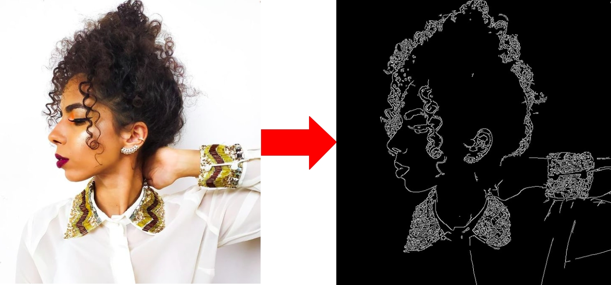

# OpenCV + Python in Azure Functions

## 🎯 About

This project was built in order to participate at the **Microsoft Azure Trial Hackathon on DEV**. If you want to learn how it works and how to start it please check my article in the dev.to platform:

* [Microsoft Azure Trial Hackathon on DEV: OpenCV with Azure Functions and Python](https://dev.to/64j0/microsoft-azure-trial-hackathon-on-dev-opencv-with-azure-functions-and-python-33lf)
* [Demo of this project in YouTube](https://youtu.be/GKwS6sofgo8).